What are `Dimensionality_reduction_comparisons` goals ?
=======================================================

`Dimensionality_reduction_comparisons` is a set of function designed to
compared dimensionality reduction methods. In order to do this we focus
on several indexes, metrics, and statistics :

-   Neighborhood preservation : Because distances are no longer
    meaningful in high dimensional space, we focus on neighborhood
    preservation between the original space and the porjection
    spaces.This problematic gather two metrics :

    -   Centrality preservation : In order to evaluate the centrality
        preservation (*C*) between the low dimensional space
        *D*<sup>*l*</sup> and the high dimensional one *D*<sup>*h*</sup>
        , we used the following formula:
        *C*<sub>*k*</sub><sup>*d*</sup>(*j*) = ∑<sub>1 ≤ *i* ≤ *N*</sub>*k* − *ρ*<sub>*i*</sub><sup>*d*</sup>(*j*)
         For the scale *k*, and for dimension *d*, *j*’s centrality is
        defined as the sum of differences between *k* and
        *ρ*<sub>*i*</sub><sup>*d*</sup>(*j*), which is the rank of *j*
        in the *k*−neighborhood of *i*. Like this high *C* values
        represent central points and reciprocally. This metric applied
        on the projection could be used as a visual tool to evaluate the
        consistency of the chosen *k* level. Furthermore, to evaluated
        how local proprieties are affected by the projection, means of
        absolutes differences between all *C**P*<sup>*l*</sup> and
        *C**P*<sup>*h*</sup> for each *k* were calculated such as
        $CP\_k = \\frac{1}{N} \\sum\_{i = 1}^N (\|C^l\_i - C^h\_i\|)$.
        Finally non parametric tests were realised to evaluated, if
        *C**P*<sub>*k*</sub> distributions, obtained on real data, are
        the same than the ones expected under the random hypothesis, and
        to evaluate if the observed distributions are equal for the
        different DR methods.

    -   Sequence diffence view : The preservation of the
        *k*−neighborhood between *D*<sup>*l*</sup> and *D*<sup>*h*</sup>
        was calculated according the Sequence Difference view metric
        (*S**D*) . For each point *i* at the level *k*, *S**D*’s formula
        is:
        $$SD\_k(i) = \\frac{1}{2} \\sum\_{j \\in V^l\_k(i)}(k-\\rho^l\_i(j)).\|\\rho^l\_i(j)-\\rho^h\_i(j)\|+  \\frac{1}{2} \\sum\_{j \\in V^h\_k(i)}(k-\\rho^h\_i(j)).\|\\rho^l\_i(j)-\\rho^h\_i(j)\| $$
         where *ρ*<sub>*i*</sub><sup>*d*</sup>(*j*) was previously
        defined and *V*<sub>*k*</sub><sup>*d*</sup>(*i*) is the
        *k*−neighborhood of *i* in the *d* dimension. This metric
        penalizes the non preservation of *j*’s rank between
        *D*<sup>*l*</sup> and *D*<sup>*h*</sup>, and weights this
        penalization according *i**j*’s closeness. As previously, non
        parametric tests were done on the distributions means *S**D*
        values by level *k*, to tests if observed distributions are the
        same than the ones expected under the random hypothesis, and to
        evaluated if the distributions resulting of different DR methods
        are equal.

-   The consevation variables’ spatial autocorreltation :
    -   Moran Index : Under the hypothesis that proximal points on the
        projection share a similar molecular profile, spatial
        auto-correlations were measured according Moran’s Index metric
        such as:
        $$I = \\frac{n \\sum\_{i=1}^n \\sum\_{j=1}^n W\_{ij}(x\_i - \\bar{x})(x\_j - \\bar{x})}{\\sum\_{i=1}^n \\sum\_{j=1}^n W\_{ij} \\sum\_{i=1}^n (x\_i - \\bar{x})^2}$$
         where *W*<sub>*i**j*</sub> is the spatial weight between the
        the points *i* and *j*, which belong to the set *n*,
        *x*<sub>*i*</sub> is the value of the variable in the unit *i*,
        and *x̄* the mean of *x*. The binary matrix *W* was built
        according the *k*−nearest neighbor method (KNN), like this the
        metric is still meaningful in the high dimensional space, since
        it relies on a relative definition of distances. This
        observation implies that global spatial auto-correlations are
        measured for high *k* values and that *k* must be must smaller
        than *n*. Significance of features’ Moran’s Index were tested
        according the Monte Carlo procedure to avoid the Gaussian
        hypothesis. Finally to compare DR methods according their
        performances to preserve features’ the spatial distribution,
        Moran’s Index were calculated for several variables and multiple
        comparison tests were performed.\\

Installation
============

``` r
source('../Dimensionality_reduction_comparison_metrics.R')
```

``` r
library(ade4)
library(umap)
library(dplyr)
library(data.table)
library(rspatial)
library(gridExtra)
library(ggpubr)
library(reshape2)
```

``` r
sessionInfo()
```

    ## R version 3.5.3 Patched (2019-03-11 r76734)
    ## Platform: x86_64-apple-darwin15.6.0 (64-bit)
    ## Running under: macOS Mojave 10.14.6
    ## 
    ## Matrix products: default
    ## BLAS: /Library/Frameworks/R.framework/Versions/3.5/Resources/lib/libRblas.0.dylib
    ## LAPACK: /Library/Frameworks/R.framework/Versions/3.5/Resources/lib/libRlapack.dylib
    ## 
    ## locale:
    ## [1] fr_FR.UTF-8/fr_FR.UTF-8/fr_FR.UTF-8/C/fr_FR.UTF-8/fr_FR.UTF-8
    ## 
    ## attached base packages:
    ## [1] grid      parallel  stats     graphics  grDevices utils     datasets 
    ## [8] methods   base     
    ## 
    ## other attached packages:
    ##  [1] reshape2_1.4.3      ggpubr_0.2.1        magrittr_1.5       
    ##  [4] gridExtra_2.3       rspatial_1.0-0      raster_2.9-23      
    ##  [7] sp_1.3-1            data.table_1.12.2   dplyr_0.8.3        
    ## [10] umap_0.2.2.0        ade4_1.7-13         viridis_0.5.1      
    ## [13] viridisLite_0.3.0   venn_1.7            VennDiagram_1.6.20 
    ## [16] futile.logger_1.4.3 latex2exp_0.4.0     FNN_1.1.3          
    ## [19] plotly_4.9.0        RColorBrewer_1.1-2  ggplot2_3.2.0      
    ## [22] doParallel_1.0.14   iterators_1.0.10    foreach_1.4.4      
    ## 
    ## loaded via a namespace (and not attached):
    ##  [1] reticulate_1.12      tidyselect_0.2.5     xfun_0.8            
    ##  [4] purrr_0.3.2          lattice_0.20-38      colorspace_1.4-1    
    ##  [7] htmltools_0.3.6      yaml_2.2.0           rlang_0.4.0         
    ## [10] pillar_1.4.2         glue_1.3.1           withr_2.1.2         
    ## [13] lambda.r_1.2.3       plyr_1.8.4           stringr_1.4.0       
    ## [16] ggsignif_0.5.0       munsell_0.5.0        gtable_0.3.0        
    ## [19] htmlwidgets_1.3      codetools_0.2-16     evaluate_0.14       
    ## [22] knitr_1.23           Rcpp_1.0.2           scales_1.0.0        
    ## [25] formatR_1.7          jsonlite_1.6         digest_0.6.20       
    ## [28] stringi_1.4.3        tools_3.5.3          lazyeval_0.2.2      
    ## [31] tibble_2.1.3         futile.options_1.0.1 crayon_1.3.4        
    ## [34] tidyr_0.8.3          pkgconfig_2.0.2      Matrix_1.2-17       
    ## [37] MASS_7.3-51.4        assertthat_0.2.1     rmarkdown_1.14      
    ## [40] httr_1.4.0           R6_2.4.0             compiler_3.5.3

This scpit includes the required library and `CP.R`, `SEQ_DIFF.R` and
`MORAN_I.R`.

Example : Mesomics
==================

Importation of data
-------------------

``` r
gene_expr_df <- read.table("gene_expr_mesomics_sample284_genes_7146.txt", header = T)
samples_att <- read.table("Attributes_PCA_f1.csv", header = T, sep=";")
gene_expr_df[1:5,1:4]
```

    ##   Sample_ID ENSG00000000005.5 ENSG00000000971.15 ENSG00000001626.14
    ## 1    M100PT          2.011842           15.77013           5.621739
    ## 2    M101PT          1.149539           14.44686           5.540998
    ## 3     M10PT          5.378647           11.82309           4.443388
    ## 4     M11PT          1.950380           15.19626           5.579403
    ## 5     M12PT          1.149539           15.84576           3.506552

``` r
head(samples_att[1:5, 1:4])
```

    ##   sample     B.Cells Macrophages.M1 Macrophages.M2
    ## 1 M100PT 0.023842811     0.08964012     0.10096276
    ## 2 M101PT 0.022911317     0.08422081     0.07553951
    ## 3  M10PT 0.016140069     0.04795789     0.08073783
    ## 4  M11PT 0.023082436     0.07531232     0.10286927
    ## 5  M12PT 0.008643443     0.07674706     0.04524697

The `gene_expr_df` data frame gathers the expression profile of 284
malignant pleural mesothelioma, with the normalized expression of 7145
genes. The `samples_att` contains the main clinical and physiologic
features of these 284 samples.

Dimension reductions : methods and projections
----------------------------------------------

Projection of samples on to the first two principal components.

Projection of samples according UMAP method, with the default parameter
(`min_dist` = 0.1, `n_neighbors` = 15).

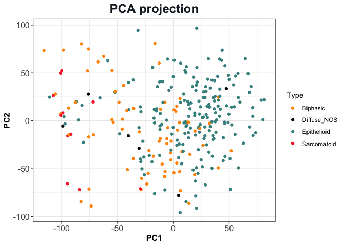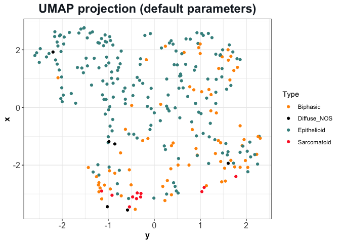

We follow the same process to generate UMAP projections modifying the
`min_dist`parameter such as
*m**i**n*\_*d**i**s**t* = \[0.1, 0.3, 0.5, 0.7, 0.9\].

Centrality preservation
-----------------------

`CP_main` function could be use to generate main analysis on centrality.
In this example centrality preservation is computed to compare the PCA
projection and UMAP projections.

``` r
List_projection <- list(data.frame(acp_fig1_li_df), data.frame(umap_md01_res_df), data.frame(umap_md03_res_df), data.frame(umap_md05_res_df), data.frame(umap_md07_res_df), data.frame(umap_md09_res_df))

gene_expr_df_filter <- merge(gene_expr_df, acp_fig1_li_df[,1], by = "Sample_ID")

Main_CP_res <- CP_main(l_data = List_projection , list_K = seq(from= 1, to = 284, by = 5) , dataRef = gene_expr_df_filter , colnames_res_df = c("pca", "umap_md=0.1", "umap_md=0.3", "umap_md=0.5","umap_md=0.7", "umap_md=0.9") , filename = NULL , graphics = TRUE, stats = TRUE)
saveRDS(Main_CP_res, "Main_CP_res.rds" )
```

``` r
theme_set(theme_bw())
Main_CP_res$Paired_wilocoxon_test
```

    ##                      pca  umap_md=0.1  umap_md=0.3  umap_md=0.5
    ## umap_md=0.1 7.924087e-10           NA           NA           NA
    ## umap_md=0.3 7.924087e-10 7.924087e-10           NA           NA
    ## umap_md=0.5 7.924087e-10 7.924087e-10 1.549704e-01           NA
    ## umap_md=0.7 7.924087e-10 7.924087e-10 6.803154e-06 7.364734e-05
    ## umap_md=0.9 7.924087e-10 1.029572e-07 1.945589e-06 2.373137e-05
    ##              umap_md=0.7
    ## umap_md=0.1           NA
    ## umap_md=0.3           NA
    ## umap_md=0.5           NA
    ## umap_md=0.7           NA
    ## umap_md=0.9 7.364734e-05

``` r
Main_CP_res$Graphic
```

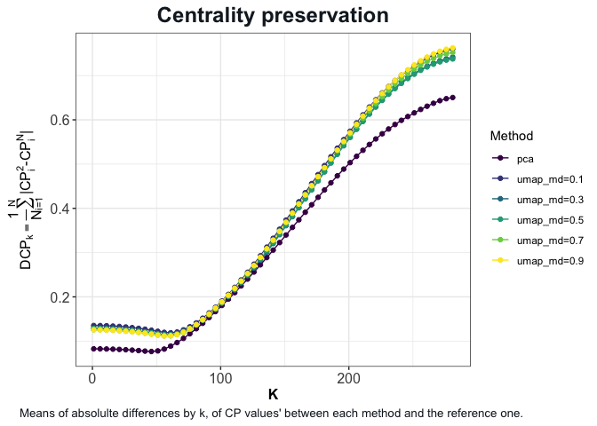

The mean ranks of the means of the absolutes differences between CP
values by k level (*D**C**P*<sub>*k*</sub>), differs significantly
between PCA and UMAP. Furthermore *D**C**P*<sub>*k*</sub> values differs
for all different values of `min-dist`, this statement was statistically
confirmed, even if it is graphically not visible. Indeed `min_dist`
produces a constant effect on CP values which implies that even small
differences allow to rejet the null hypothesis of wilcoxon tests.
According to this index the dimensionality reduction method that respect
the most the centrality is the PCA, since *D**C**P*<sub>*k*</sub> values
are lower.

**Function : ** `CP_graph_by_k`

The previously graphic could be obtained using the following function;
and a logarithmic scale could be choose.

``` r
CP_df_res = Main_CP_res[[1]][, 1:(dim(Main_CP_res[[1]])[2]-1 )]
CP_ref_df_res  = Main_CP_res[[1]][1:2]
CP_ref_df_res = cbind(CP_ref_df_res, Main_CP_res[[1]]$REF)
CP_graph_by_k(CP_df_res,  CP_ref_df_res, Names=NULL, list_col=NULL, log=TRUE)
```

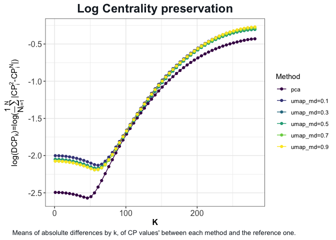

**Function : ** `CP_calcul` If users just want to compute the data frame
of CP values for different k levels the function `CP_calcul` should be
used.

``` r
CP_calcul_test <- CP_calcul(acp_fig1_li_df , list_K = c(100,150) )
head(CP_calcul_test)
```

    ##   Sample_ID   CP   K
    ## 1    M100PT 7377 100
    ## 2    M101PT 7287 100
    ## 3     M10PT 3590 100
    ## 4     M11PT 6873 100
    ## 5     M12PT 3684 100
    ## 6     M13PT 6917 100

### Significance test

If the previous statistic tests allow to know if the mean ranks of
*D**C**P*<sub>*k*</sub> values are equal between the different methods.
We have to prove if *D**C*<sub>*P*</sub>*k* values calculated using
dimensionality reduction methods are better than those expected if
projection methods put points randomly. In order to test this
hypothesis, for *n* repetitions we permute the 2D coordinates of
samples, then *C**P* values where calculated. The means distribution of
*C**P* values obtained on random data was calculated. Finally a wilcoxon
test was effectued to compare the mean ranks of *D**C**P*<sub>*k*</sub>
values obtained on the real projection coordinates and the random
projection coordinates.

``` r
permut_test = CP_permutation_test(data = data.frame(umap_md01_res_df), data_ref = gene_expr_df_filter, seq(1,284,10),  n=40, graph = TRUE)
saveRDS(permut_test, "permut_test_meso_0708.rds")
```

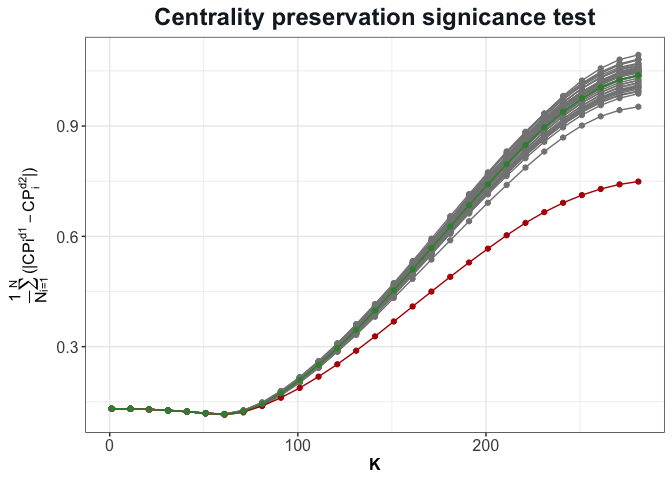

    ## 
    ##  Wilcoxon rank sum test
    ## 
    ## data:  Means_alea and main_diff_df[, 1]
    ## W = 3, p-value = 2.328e-16
    ## alternative hypothesis: true location shift is less than 0

The means rank of *D**C**P*<sub>*k*</sub> values resulting from the PCA
projection are statically different from the one obtained on random
data.

The significance test could be realized for a level *k* using a monte
carlo procedure using the `CP_monte_carlo` function.

``` r
CP_UMAP_MC_stat <- CP_monte_carlo(data = data.frame(umap_md01_res_df), data_ref = gene_expr_df_filter, k_val =30, n=100)
saveRDS(CP_UMAP_MC_stat,"CP_UMAP_MC_stat.rds" )
```

``` r
CP_UMAP_MC_stat
```

    ## [[1]]
    ## [[1]]$statistic
    ## statistic 
    ## 0.9830066 
    ## 
    ## [[1]]$parameter
    ## observed rank 
    ##             1 
    ## 
    ## [[1]]$p.value
    ## [1] 0.00990099
    ## 
    ## [[1]]$alternative
    ## [1] "lower"
    ## 
    ## [[1]]$method
    ## [1] "Monte-Carlo simulation of DCP values"

### Centrality map

An useful representation associated to the centrality preservation,
could be done with two plot. The first one is a plot of centrality
values projected on the 2 dimensional space, and the second one is the
projection of centrality values calculated on the high dimensional space
and projected on the 2 dimensional space. The first plot just show if
the chosen *k* level is consistent and the second one show the
preservation. These representations could be done using `CP_map`
function.

    ## Warning: `data_frame()` is deprecated, use `tibble()`.
    ## This warning is displayed once per session.

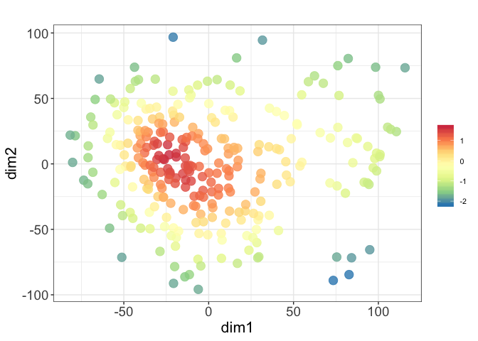

``` r
CP_Map_calcul_R <- CP_calcul(as.data.table(gene_expr_df) , list_K = c(100) )
CP_K_R = CP_Map_calcul_R[which( CP_Map_calcul_R$K == 100),]
CP_K_R  = data_frame("Sample_ID" = CP_K_R$Sample_ID, "K" = CP_K_R$K, "CP"= scale(CP_K_R$CP))
CP_map(CP_K_R , acp_fig1_li_df, list(100), Title = 'CP values calculated on genomics data and projected on the PCA layout')
```

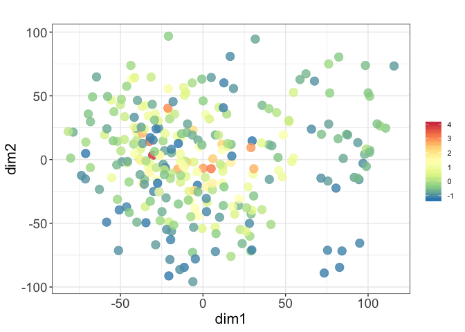

We could repeat this process according the UMAP projection.

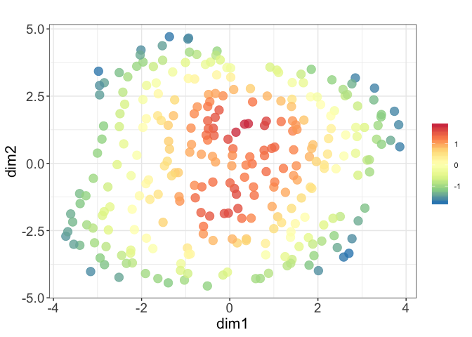

``` r
CP_Map_calcul_R <- CP_calcul(as.data.table(gene_expr_df) , list_K = c(100) )
CP_K_R = CP_Map_calcul_R[which( CP_Map_calcul_R$K == 100),]
CP_K_R  = data_frame("Sample_ID" = CP_K_R$Sample_ID, "K" = CP_K_R$K, "CP"= scale(CP_K_R$CP))
CP_map(CP_K_R , umap_md07_res_df, list(100), Title = 'CP values calculated on genomics data and projected on the UMAP layout')
```

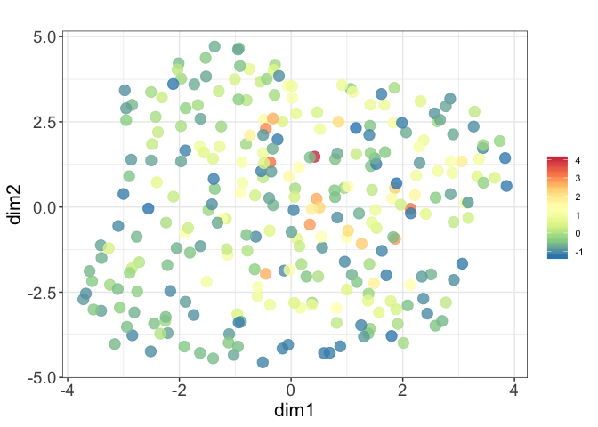

Sequence difference view :
--------------------------

The sequence difference (SD) view metric is a metric that takes into
account :

-   The number of true neighbors that a projected point has,

-   and the potentially reordering of its neighborhood.

### Main function :

The main function could be use to calculate SD values, to get graphical
representation and to obtain statistics.

``` r
List_projection <- list(data.frame(acp_fig1_li_df),data.frame(umap_md01_res_df), data.frame(umap_md03_res_df), data.frame(umap_md05_res_df), data.frame(umap_md07_res_df), data.frame(umap_md09_res_df)) # , 

gene_expr_df_filter <- merge(gene_expr_df, acp_fig1_li_df[,1], by = "Sample_ID")


Main_SQ_res <- Seq_main(l_data = List_projection , dataRef = gene_expr_df_filter, listK = seq(from= 1, to = 280, by = 25), colnames_res_df = c("pca",  "umap_md=0.1", "umap_md=0.3", "umap_md=0.5","umap_md=0.7","umap_md=0.9")  , filename = NULL , graphics = TRUE, stats = TRUE) #``
saveRDS(Main_SQ_res, "Main_SQ_res.rds")
```

For small k values, we cannot observe differences, a logarithmic scale
should be more appropriated. For large k values the PCA seems to be more
conservative, since SD values are lower.

    ##              pca2 umap_md=0.13 umap_md=0.34 umap_md=0.55 umap_md=0.76
    ## umap_md=0.13    1           NA           NA           NA           NA
    ## umap_md=0.34    1    0.1046311           NA           NA           NA
    ## umap_md=0.55    1    0.2103875   0.05785939           NA           NA
    ## umap_md=0.76    1    0.1846609   1.00000000    0.1593160           NA
    ## umap_md=0.97    1    0.3635756   0.05785939    0.8380569   0.05785939

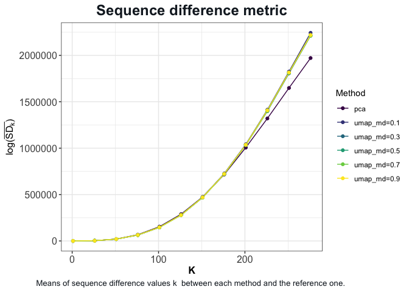

**Zoom in on small k values : **

``` r
List_projection <- list(data.frame(acp_fig1_li_df),data.frame(umap_md01_res_df), data.frame(umap_md03_res_df), data.frame(umap_md05_res_df), data.frame(umap_md07_res_df), data.frame(umap_md09_res_df)) # , 

gene_expr_df_filter <- merge(gene_expr_df, acp_fig1_li_df[,1], by = "Sample_ID")


Main_SQ_res3 <- Seq_main(l_data = List_projection , dataRef = gene_expr_df_filter, listK = seq(from= 1, to = 40, by = 5), colnames_res_df = c("pca",  "umap_md=0.1", "umap_md=0.3", "umap_md=0.5","umap_md=0.7","umap_md=0.9")  , filename = NULL , graphics = FALSE, stats = TRUE) #

saveRDS(Main_SQ_res3, "Main_sq_res_smallK_meso.rds")
```

**Statistic tests : **

    ##                   pca2 umap_md=0.13 umap_md=0.34 umap_md=0.55 umap_md=0.76
    ## umap_md=0.13 0.3374141           NA           NA           NA           NA
    ## umap_md=0.34 0.3374141    0.3374141           NA           NA           NA
    ## umap_md=0.55 0.3374141    0.3374141    0.3374141           NA           NA
    ## umap_md=0.76 0.3374141    0.3374141    0.3374141    0.3374141           NA
    ## umap_md=0.97 0.3374141    0.3374141    0.3374141    0.3374141    0.3374141

We could reprensent the data on a logarithmic scale using the function
`Seq_graph_by_k`.
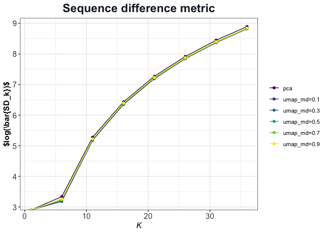

Using a logarithmic scale we observed than for small k values, UMAP is
more conservative, although it is not statiscally significatif.

### Significance test

Finally for each DR technic we have to check if sequence difference
values are lower than those expected if the low dimensional
representation were random. In order to do this as previously we permute
samples’ coordinates and we calculate the sequence difference values.
After n simulation we calculated the mean distribution and we realize a
wilcoxon test with an unilateral hypothesis.

``` r
seq_permut <- seq_permutation_test(data = data.frame(umap_md07_res_df), data_ref = gene_expr_df_filter, list_K = seq(1,284,10), n=4, graph = TRUE)
saveRDS(seq_permut,"seq_permut_meso_2506.rds" )
```

``` r
seq_permut
```

    ## [[1]]
    ## 
    ##  Wilcoxon rank sum test
    ## 
    ## data:  main_df[, 1] and Means_alea
    ## W = 37, p-value = 4.009e-12
    ## alternative hypothesis: true location shift is less than 0
    ## 
    ## 
    ## [[2]]

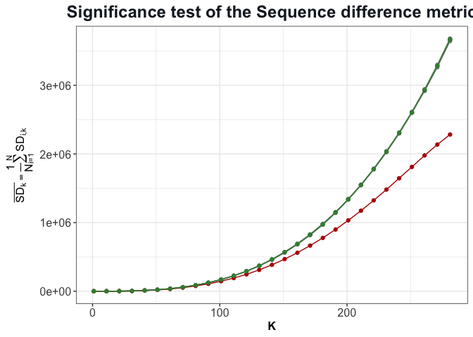

On this graph the red curve represents the sequence difference values
resulting from the UMAP projection, and the gray ones result from
sequence difference values calculated on randomized low dimensional
coordinates. Because UMAP sequence difference values are lower than the
ones that are expected on random data, we could confirm that UMAP
preserve point’s neighborhood. This observation is statiscally confirm
by the Wilcoxon test.

Spatial Autocorrelation
-----------------------

Dimensionnality reduction techniques allow to extract the key feataures.
Like this it is inetresting to check if correlations are preserved. The
Moran Index allow to measure spatial autocorrelation, this statistic is
defined according the notion of neighborhood and so for different k
level.

### Calculation of Moran Indexes

For different variables, we could use the main function associated to
Moran index, to calculated this statistic, generated statistics and
graphics.

``` r
spatial_att_2 <- data.frame("Sample_ID" = as.character(samples_att$sample),"VISTA" = samples_att$VISTA , "VEGFR1" =  samples_att$VEGFR1,  "PDL1" =  samples_att$PDL1, "B_cells" = samples_att$B.Cells)

List_coords_2 <- list('pca' = data.frame(acp_fig1_li_df),'umap_md=01'= data.frame(umap_md01_res_df), 'umap_md=03'=data.frame(umap_md03_res_df), 'umap_md=05' =data.frame(umap_md05_res_df), 'umap_md=07'=data.frame(umap_md07_res_df), 'umap_md=09'=data.frame(umap_md09_res_df), 'gene_expr_data'=data.frame(gene_expr_df))

MI_meso <- moran_I_main(l_coords_data = List_coords_2  , spatial_data =spatial_att_2, listK= seq(50), nsim = 10, Stat=FALSE, Graph = TRUE, methods_name = c('pca','umap_md=01','umap_md=03','umap_md=05', 'umap_md=07','umap_md=09','gene_expr_data'))
```

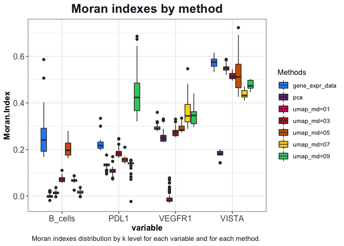

### Representation of Moran Indexes by level k

Then we could calculate Moran indexes for all k values and for different
variables, like for the differents DR technics we get the following
graphics :

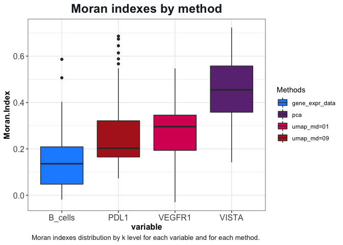

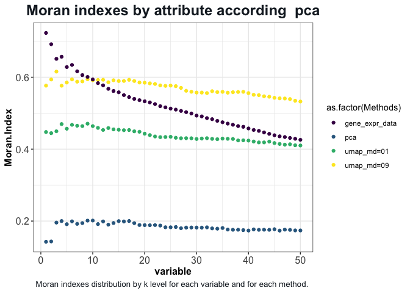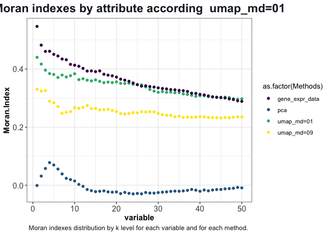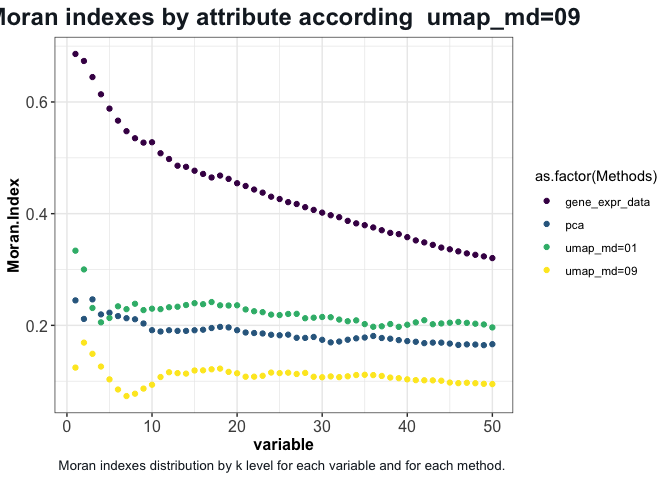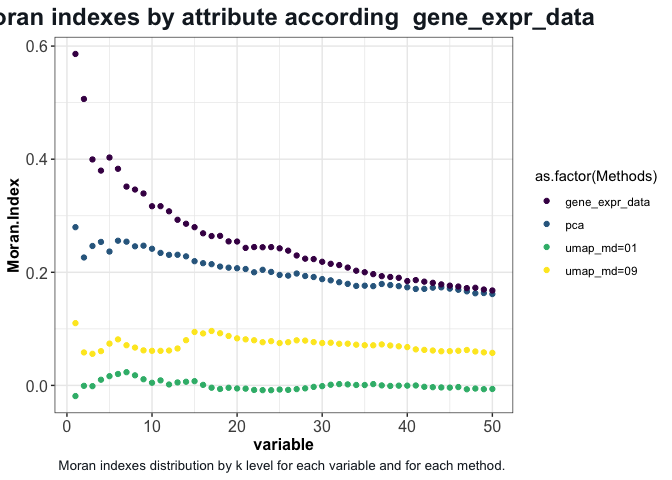
Globally the different technics tend to maintain the same spatial
auto-correlations than those observe in the high dimensional space. We
also observe that the chosen `min_dist` parameter could influenced the
spatial auto-correlations.

Example : Lung NeuroEndocrin Neoplasm (LNEN)
============================================

**For the MESOMICS dataset a continuum of molocular profiles appeared,
like this neither the PCA nor UMAP create clusters. At the opposite for
the LNEN dataset revelant molecular group have been identified. This
second example allow to show one of the PCA limitation. The PCA is based
on a linear transformation of data to find a basis which preserves the
maximal amount of variability. On a two dimensional projection no more
than three equidistant group could be display, that evidence justify the
UMAP use. Nevertheless it is important to keep in mind that if we could
represent more than three groups in a two dimensional projection large
distances are no longer meaningful.**

Importation of data
-------------------

-   Importation of the genes expression data frame, that includes the
    genes which explained more than 50% of the variation.
-   Importation of the features data frame, which gathers the clinical,
    the histopathological features … etc

``` r
gene_expr_type_LNEN_df <- read.table("gene_expr_LNEN_SCLC_LCNEC.tsv", header = F)
samples_att_LNEN <- read.table("Attributes_LNEN_SCLC.tsv", header = T, sep = '\t')
Histo_6A <- read.table("Histo6A.tsv",  header = T)
```

Dimensionality reduction
------------------------

As previously we are going to compare the PCA and the UMAP
dimensionality reduction technics :

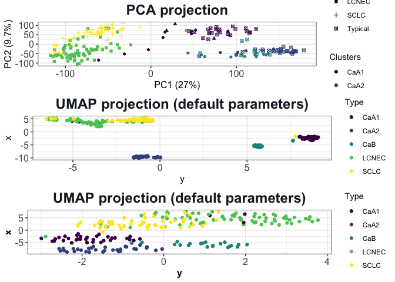

We follow the same process to generate other UMAP projections modifying
the `min_dist`parameter such as
*m**i**n*\_*d**i**s**t* = \[0.1, 0.3, 0.5, 0.7, 0.9\].

Centrality preservation
-----------------------

`CP_main` function allows to get the main informations about centrality
preservation, according the different DR methods.

``` r
List_projection <- list(data.frame(acp_fig1_li_df), data.frame(umap_md01_res_df), data.frame(umap_md03_res_df), data.frame(umap_md05_res_df), data.frame(umap_md07_res_df), data.frame(umap_md09_res_df))

colnames(gene_expr_type_LNEN_df)[1] <- "Sample_ID"
gene_expr_df_filter <- merge(gene_expr_type_LNEN_df, acp_fig1_li_df[,1], by = "Sample_ID")

Main_CP_res_LNEN <- CP_main(l_data = List_projection , list_K = seq(from= 1, to = 210, by = 5) , dataRef = gene_expr_df_filter , colnames_res_df = c("pca", "umap_md=0.1", "umap_md=0.3", "umap_md=0.5","umap_md=0.7", "umap_md=0.9") , filename = NULL , graphics = TRUE, stats = TRUE)
saveRDS(Main_CP_res_LNEN, 'Main_CP_res_LNEN.rds')
```

``` r
Main_CP_res_LNEN$Paired_wilocoxon_test
```

    ##                      pca  umap_md=0.1  umap_md=0.3  umap_md=0.5
    ## umap_md=0.1 6.821210e-12           NA           NA           NA
    ## umap_md=0.3 3.643196e-06 6.821210e-12           NA           NA
    ## umap_md=0.5 6.821210e-12 4.555534e-01 1.005901e-08           NA
    ## umap_md=0.7 4.167327e-04 6.821210e-12 5.162544e-01 6.821210e-12
    ## umap_md=0.9 6.821210e-12 6.821210e-12 2.602632e-03 1.167746e-05
    ##             umap_md=0.7
    ## umap_md=0.1          NA
    ## umap_md=0.3          NA
    ## umap_md=0.5          NA
    ## umap_md=0.7          NA
    ## umap_md=0.9   0.9802613

``` r
Main_CP_res_LNEN$Graphic
```

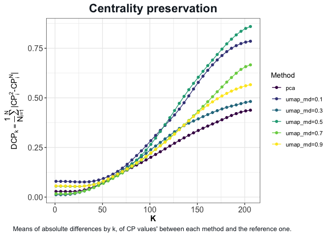

The means ranks of *D**C**P*<sub>*k*</sub> values differ between the PCA
and UMAP, this was statically confirmed and graphically evident. As
previously the `min_dist` parameter affect the centrality preservation,
however for this data set the local structure is better preserve with
UMAP setting `min_dist` to 0.9 or 0.1. For *k* level greater than 100
the PCA better preserves the structure. Finally on LNEN data set high
values of `min_dist` seem to improve the preservation of the global
structure.

**Centrality preservation using the first four eigenvalues of the PCA.**
Using the first two axis of the PCA we cannot display on a two
dimensional projection more than three equidistant cluster. Because the
LNEN dataset presents 5 clusters it could be interesting to evaluate the
this metric according the first four axis of the PCA (*n* − 1).

``` r
acp_4D <- dudi.pca( gene_expr_LNEN_df_for_PCA,center = T , scale = F , scannf = F , nf=4) #
acp_4D_li_df =  as.data.frame(acp_4D$li)
acp_4D_li_df  = setDT(acp_4D_li_df , keep.rownames = TRUE)[]
colnames(acp_4D_li_df )[1]<-'Sample_ID'
acp_4D_li_type_df = merge(acp_4D_li_df , Clusters_LNEN_df , by="Sample_ID")
acp_4D_li_type_df = merge(acp_4D_li_type_df, Histo_6A, by="Sample_ID")
```

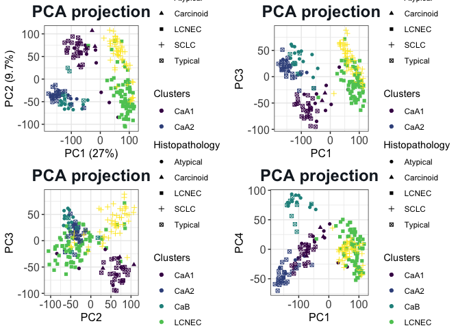

``` r
List_projection <- list( data.frame(acp_4D_li_df),data.frame(acp_fig1_li_df), data.frame(umap_md01_res_df), data.frame(umap_md09_res_df))

Main_CP_res_LNEN_PCA_4D_vfig <- CP_main(l_data = List_projection , list_K = seq(from= 1, to = 208, by = 5) , dataRef = gene_expr_df_filter , colnames_res_df = c("PCA_4D", "PCA", "UMAP_md01_nn15", "UMAP_md09_nn100") , filename = NULL , graphics = TRUE, stats = FALSE)
saveRDS(Main_CP_res_LNEN_PCA_4D_vfig, "Main_CP_res_LNEN_PCA_4D.rds")
```

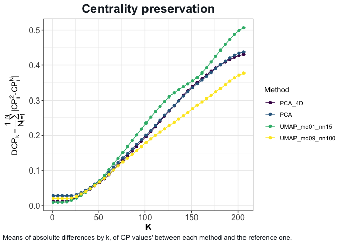

**Logarithmic representation**

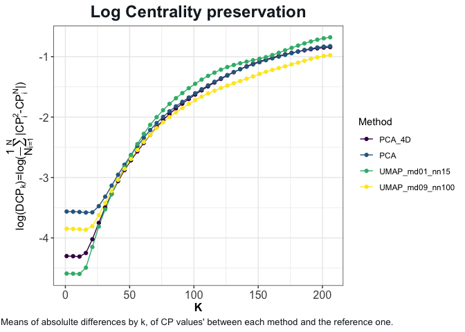

### Significance test according umap projection

As previously we check if *C**P* values obtained using UMAP stastically
different from those calculated on random data, using the
`CP_permutation_test`.

``` r
permut_test_LNEN_UMAP <- CP_permutation_test(data = data.frame(umap_md01_res_df), data_ref = data.frame(gene_expr_df_filter), seq(1,210,12),  n=10, graph = TRUE)
saveRDS(permut_test_LNEN_UMAP, "CP_ermut_test_LNEN_UMAP.rds")
```

``` r
permut_test_LNEN_UMAP
```

    ## [[1]]

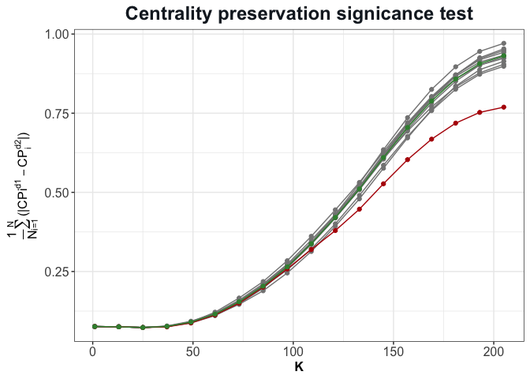

    ## 
    ## [[2]]
    ## 
    ##  Wilcoxon rank sum test
    ## 
    ## data:  Means_alea and main_diff_df[, 1]
    ## W = 0, p-value = 1.102e-10
    ## alternative hypothesis: true location shift is less than 0

Graphically and statiscally UMAP allows a better presrvation of data
structure than ones expected on randomised projections.

### Centrality preservation map

As previously we could represent *C**P* values calculated on the 2
dimensional projection and on the high dimensional space on a 2D
projection, using `CP_map` function.

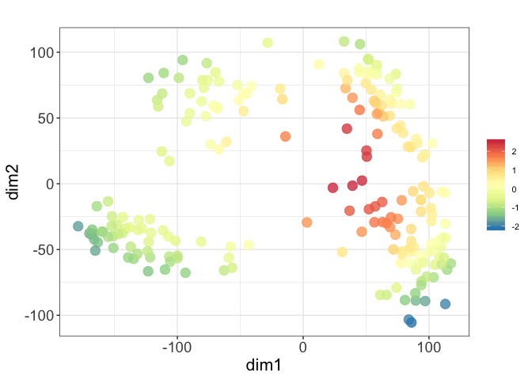

``` r
colnames(gene_expr_type_LNEN_df)[1] <- "Sample_ID"
gene_expr_df_filter <- merge(gene_expr_type_LNEN_df, acp_fig1_li_df[,1], by = "Sample_ID")

CP_Map_calcul_R <- CP_calcul(as.data.table(gene_expr_df_filter) , list_K = c(15) )
CP_K_R = CP_Map_calcul_R[which( CP_Map_calcul_R$K == 15),]
CP_K_R  = data_frame("Sample_ID" = as.character(CP_K_R$Sample_ID), "K" = CP_K_R$K, "CP"= scale(CP_K_R$CP))
CP_map(CP_K_R , acp_fig1_li_df, list(15), Title = 'CP values calculated on genomics data and projected on the PCA layout')
```

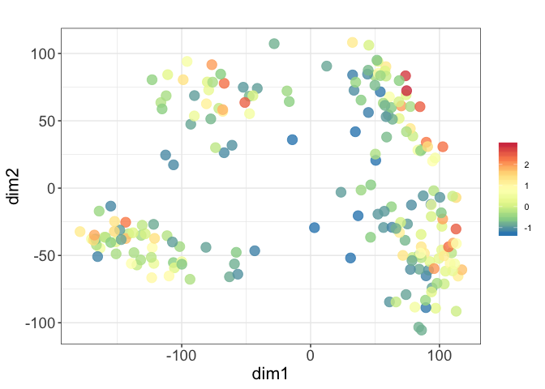

**According UMAP layout**

We could repeat this process according the UMAP projection.

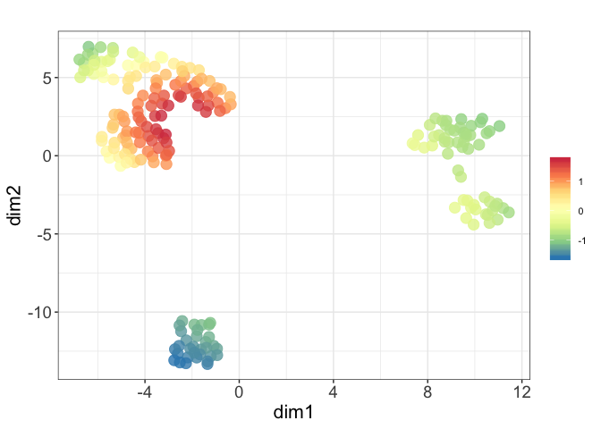

``` r
CP_Map_calcul_R <- CP_calcul(as.data.table(gene_expr_df_filter) , list_K = c(140) )
CP_K_R = CP_Map_calcul_R[which( CP_Map_calcul_R$K == 140),]
CP_K_R  = data_frame("Sample_ID" = CP_K_R$Sample_ID, "K" = CP_K_R$K, "CP"= scale(CP_K_R$CP))
CP_map(CP_K_R , umap_md07_res_df, list(140), Title = 'CP values calculated on genomics data and projected on the UMAP layout')
```

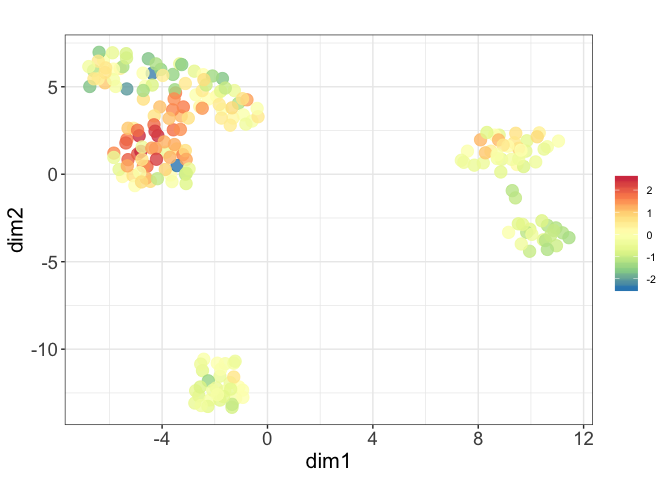

Sequence difference view :
--------------------------

As previously explained once the consistancy of points position is
checked we have to measure the preservation of points’ neighborhood.

### Main function :

As previously we first could apply the main function to calculate the
sequence difference values to have the main graphic, and to obtain
statistics that compare the different technics.

``` r
List_projection <- list(data.frame(acp_fig1_li_df),data.frame(umap_md01_res_df), data.frame(umap_md03_res_df), data.frame(umap_md05_res_df), data.frame(umap_md07_res_df), data.frame(umap_md09_res_df)) # , 

colnames(gene_expr_type_LNEN_df)[1] <- "Sample_ID"
gene_expr_df_filter <- merge(gene_expr_type_LNEN_df, acp_fig1_li_df[,1], by = "Sample_ID")

Main_SQ_res_LNEN <- Seq_main(l_data = List_projection , dataRef = gene_expr_df_filter, listK = seq(from= 1, to = 208, by = 5), colnames_res_df = c("pca",  "umap_md=0.1", "umap_md=0.3", "umap_md=0.5","umap_md=0.7","umap_md=0.9")  , filename = NULL , graphics = TRUE, stats = TRUE) #
saveRDS( Main_SQ_res_LNEN,  "SQ_MAIN_LNEN.rds")
```

    ##                      pca2 umap_md=0.13 umap_md=0.34 umap_md=0.55
    ## umap_md=0.13 0.0003903556           NA           NA           NA
    ## umap_md=0.34 0.0013563303 1.433673e-05           NA           NA
    ## umap_md=0.55 0.0005459785 2.602591e-03 1.435558e-04           NA
    ## umap_md=0.76 0.0003778449 1.655807e-01 1.912633e-05 1.614930e-03
    ## umap_md=0.97 0.0318827711 1.270746e-05 1.270746e-05 3.086033e-05
    ##              umap_md=0.76
    ## umap_md=0.13           NA
    ## umap_md=0.34           NA
    ## umap_md=0.55           NA
    ## umap_md=0.76           NA
    ## umap_md=0.97   1.6101e-05

The values that result from the PCA are statiscally different from those
obtained using UMAP and this whatever the `min_dist` parameter value.
Furthemore, the `min_dist` parameter significally impacts the sequence
difference values since most of the time the null hypothesis is
rejected.

``` r
Main_SQ_res_LNEN$graphics
```

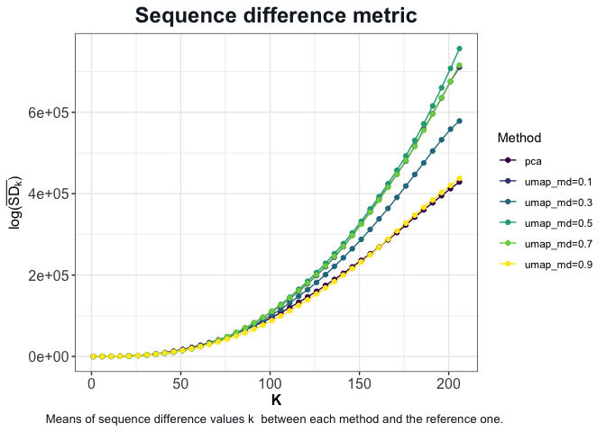

**Zoom in on small k values.**

``` r
Main_SQ_res_smallK_LNEN <- Seq_main(l_data = List_projection , dataRef = gene_expr_df_filter, listK = seq(from= 1, to = 40, by = 5), colnames_res_df = c("pca",  "umap_md=0.1", "umap_md=0.3", "umap_md=0.5","umap_md=0.7","umap_md=0.9")  , filename = NULL , graphics = FALSE, stats = TRUE) #
saveRDS(Main_SQ_res_smallK_LNEN, "Main_SQ_res_smallK_LNEN.rds")
```

``` r
Main_SQ_res_smallK_LNEN$pWT
```

    ##                   pca2 umap_md=0.13 umap_md=0.34 umap_md=0.55 umap_md=0.76
    ## umap_md=0.13 0.3374141           NA           NA           NA           NA
    ## umap_md=0.34 0.3374141    0.3374141           NA           NA           NA
    ## umap_md=0.55 0.3374141    0.3374141    0.3374141           NA           NA
    ## umap_md=0.76 0.3374141    0.3374141    0.3374141    0.3374141           NA
    ## umap_md=0.97 0.3374141    0.3374141    0.3374141    0.3374141    0.3374141

According this representation we observe that UMAP is localy more
conservative.

**As could previously it could be interesting to evaluate the Sequence
difference metric for the first four eigenvectors of the PCA.**

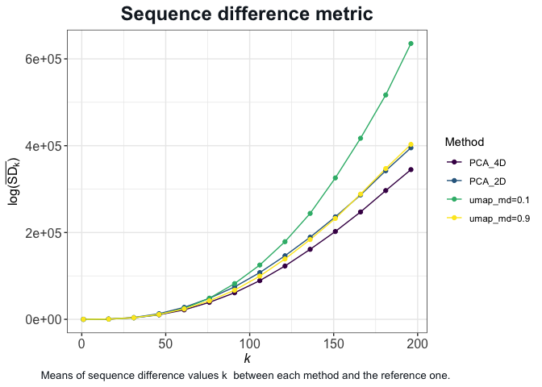

    ##                  PCA_4D2    PCA_2D3 umap_md=0.14
    ## PCA_2D3      0.009970167         NA           NA
    ## umap_md=0.14 0.013333416 0.05065889           NA
    ## umap_md=0.95 0.009970167 0.12417473   0.01925889

### Significance test

Finally we have to check if sequence difference values obtained are
statistically different from those expected under the random hypothesis.

``` r
seq_permut_Umap_LNEN <- seq_permutation_test(data = data.frame(umap_md07_res_df), data_ref = gene_expr_df_filter, list_K = seq(1,210,10), n=4, graph = TRUE)
saveRDS(seq_permut_Umap_LNEN ,"seq_permut_Umap_LNEN .rds" )
```

``` r
seq_permut_Umap_LNEN
```

    ## [[1]]
    ## 
    ##  Wilcoxon rank sum test
    ## 
    ## data:  main_df[, 1] and Means_alea
    ## W = 21, p-value = 6.514e-09
    ## alternative hypothesis: true location shift is less than 0
    ## 
    ## 
    ## [[2]]

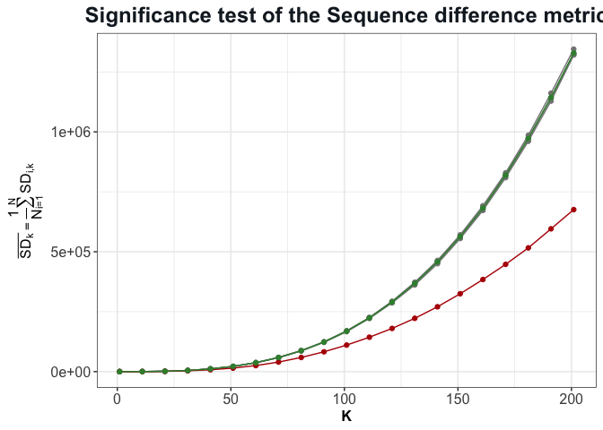

According the previous statistic and the sttistic test UMAP preserve the
points’ neighborhood.

Spatial Autocorrelation
-----------------------

As previously we could use the Moran’s statistic to measure spatial
auto-correlations, in order to know if the different dimensionality
reduction methods allow to extract the same features.

### Calculation of Moran Indexes

Firstly we could the Moran indexes values for different features and for
the different DR methods using the `moran_I_main` function.

``` r
spatial_att <- data.frame("Sample_ID" = as.character(samples_att_LNEN$Sample_ID),"CYP2C8" = samples_att_LNEN$CYP2C8 , "OTP" =  samples_att_LNEN$OTP,  "Neutrophils" =  samples_att_LNEN$Neutrophils)

spatial_att <- spatial_att[complete.cases(spatial_att),] 
spatial_att_kepp_ids <- data_frame("Sample_ID" = spatial_att$Sample_ID)

acp_fig1_li_df <- merge(acp_fig1_li_df, spatial_att_kepp_ids, by = 'Sample_ID' )
umap_md01_res_df <-  merge(umap_md01_res_df , spatial_att_kepp_ids, by = 'Sample_ID' )
umap_md03_res_df <-  merge(umap_md03_res_df , spatial_att_kepp_ids, by = 'Sample_ID' )
umap_md05_res_df <-  merge(umap_md05_res_df , spatial_att_kepp_ids, by = 'Sample_ID' )
umap_md07_res_df <-  merge(umap_md07_res_df , spatial_att_kepp_ids, by = 'Sample_ID' )
umap_md09_res_df <-  merge(umap_md09_res_df , spatial_att_kepp_ids, by = 'Sample_ID' )
gene_expr_df_filter  <- merge(gene_expr_df_filter, spatial_att_kepp_ids, by = 'Sample_ID' )

List_coords <- list('pca' = data.frame(acp_fig1_li_df),'umap_md=01'= data.frame(umap_md01_res_df), 'umap_md=03'=data.frame(umap_md03_res_df), 'umap_md=05' =data.frame(umap_md05_res_df), 'umap_md=07'=data.frame(umap_md07_res_df), 'umap_md=09'=data.frame(umap_md09_res_df), 'gene_expr_data'=data.frame(gene_expr_df_filter))

MI_LNEN <- moran_I_main(l_coords_data = List_coords  , spatial_data =spatial_att, listK= seq(5,200,10), nsim = 10, Stat=FALSE, Graph = TRUE, methods_name = c('pca','umap_md=01','umap_md=03','umap_md=05', 'umap_md=07','umap_md=09','gene_expr_data'))
```


According to these results we observe that the spatial auto-correlations
calculated in the low dimensional space are consistant with those obtain
in the high dimensional space. For the chosen features it is difficult
to affirm if the DR methods tend to increase or decrease the spatial
autocorrelations observed in the high dimensional space. Finally, we
observe that the choice of `min_dist` parameter highly interfer with the
spatial auto-correlations values.

``` r
umap_md09 = umap(gene_expr_umap_df, min_dist = 0.9, n_neighbors = 100)
umap_md09_res_df <-  data.frame("Sample_ID" = Clusters_LNEN_df$Sample_ID, "Axis1" = umap_md09$layout[, 1], "Axis2" = umap_md09$layout[, 2])
umap_md09_res_df$Sample_ID <- as.character(umap_md09_res_df$Sample_ID)
umap_md09_res_df <- umap_md09_res_df[-which(umap_md09_res_df$Sample_ID == "S02322.R2"| umap_md09_res_df$Sample_ID == "S00716_B"),]

umap_md01 = umap(gene_expr_umap_df)
umap_md01_res_df <-  data.frame("Sample_ID" = Clusters_LNEN_df$Sample_ID, "Axis1" = umap_md01$layout[, 1], "Axis2" = umap_md01$layout[, 2])
umap_md01_res_df$Sample_ID <- as.character(umap_md01_res_df$Sample_ID)
umap_md01_res_df <- umap_md01_res_df[-which(umap_md01_res_df$Sample_ID == "S02322.R2"| umap_md01_res_df$Sample_ID == "S00716_B"),]

acp_4D_li_df <- acp_4D_li_df[-which(acp_4D_li_df$Sample_ID == "S02322.R2" | acp_4D_li_df$Sample_ID == "S00716_B" ),]

acp_fig1_li_df <- acp_fig1_li_df[-which(acp_fig1_li_df$Sample_ID == "S02322.R2" | acp_fig1_li_df$Sample_ID == "S00716_B" ),]


MI_LNEN <- moran_I_main(l_coords_data = List_coords  , spatial_data =spatial_att, listK= seq(5,200,10), nsim = 10, Stat=FALSE, Graph = TRUE, methods_name = c('pca','umap_md=01','umap_md=03','umap_md=05', 'umap_md=07','umap_md=09','gene_expr_data'))
```

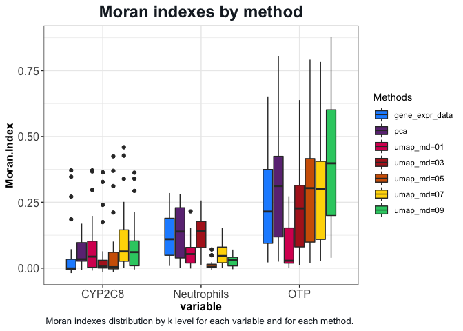

``` r
MI_meso_by_k = moran_I_scatter_plot_by_k(data = as.array(MI_LNEN)[[1]], Xlab = NULL, Ylab=NULL, Title= NULL)
```

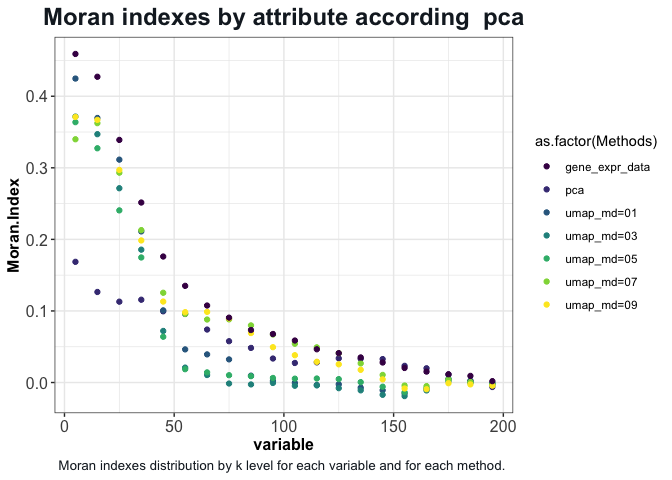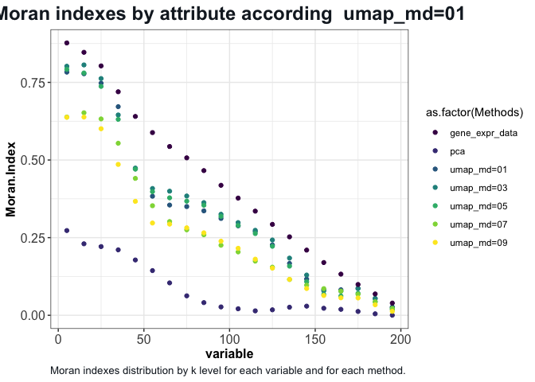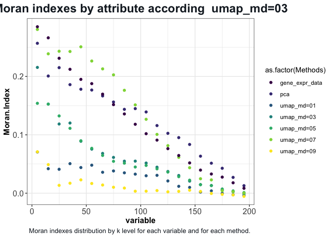

### Overlap the features that have the highest Moran index according the different methods

For a given k level we could determined the Moran Indexes values for all
genes and for different methods (PCA, UMAP, high dimensional data),
using the funcion `moran_ranking`. This function allows to calculated
Moran indexes of a list of features according *a* level k and It allows
to return a data frame containing the results. The function also allows
to order the lists of genes according their Moran Index and to determine
the overlapping between the different methods taking into account the
first *n* genes.

``` r
all_genes <- read.table("VST_nosex_TCACLCNECSCLC.txt", header = T)
#colnames(all_genes) 
all_genes <- all_genes[,- which(colnames(all_genes) == "S02322_B")]
colnames(all_genes)[which(colnames(all_genes) == "S02322_A")] = "S02322.R1"

vst_mat <- all_genes[,c(which(colnames(all_genes) %in% as.character(samples_att_LNEN$Sample_ID)))]
rvdm <- apply(vst_mat,1,stats::var)
ntopdm = rev(which( cumsum( sort(rvdm,decreasing = T) )/sum(rvdm) <= 0.5 ))[1] + 1
selectdm <- order(rvdm, decreasing = TRUE)[seq_len(min(ntopdm, length(rvdm)))]
dim(vst_mat)
vst_mat <- vst_mat[selectdm,]
dim(vst_mat)
vst_mat  <- t(vst_mat)

acp_fig1_li_df <- acp_fig1_li_df[order(acp_fig1_li_df$Sample_ID),]
umap_md09_res_df <- umap_md09_res_df[order(umap_md09_res_df$Sample_ID),]
gene_expr_df_filter$Sample_ID <- as.character(gene_expr_df_filter$Sample_ID)
gene_expr_df_filter <- gene_expr_df_filter[order(gene_expr_df_filter$Sample_ID),]

List_coords <- list('pca' = data.frame(acp_fig1_li_df), 'umap_nn=09'=data.frame(umap_md09_res_df), 'gene_expr_data'=data.frame(gene_expr_df_filter))
vst_mat_sample <- cbind("Sample_ID" = acp_fig1_li_df$Sample_ID , vst_mat)
vst_mat_sample <- apply(vst_mat_sample[,2:dim(vst_mat_sample )[2]] , 2, as.numeric)
vst_mat_sample <- as.data.frame(vst_mat_sample)
vst_mat_sample <- cbind('Sample_ID' = as.character(spatial_att$Sample_ID), vst_mat_sample )
vst_mat_sample$Sample_ID <- as.character(vst_mat_sample$Sample_ID)
vst_mat_sample <- vst_mat_sample[order(vst_mat_sample$Sample_ID),]

MI_LNEN_rank <- moran_ranking(l_coords_data = List_coords, spatial_data = vst_mat_sample, K_value =30, methods_name = NULL, N = 10)
```

According to the venn table a venn diagram could be built. For
*n* = 1000 we obtained the following diagram :

[Venn\_diagram](moran_I_venn.pdf)

### Moran Index overlapping between PCA 4D and UMAP nn =121

``` r
vst50_TCACLCNECSCLC<- read.table("VST_nosex_50pc_TCACLCNECSCLC.txt", header = T)
dim(vst50_TCACLCNECSCLC)

# SELECTION
vst50_TCACLCNECSCLC <- data.frame(t(vst50_TCACLCNECSCLC ))
vst50_TCACLCNECSCLC_designRD <- vst50_TCACLCNECSCLC 
vst50_TCACLCNECSCLC_designRD <- vst50_TCACLCNECSCLC_designRD[- which(rownames(vst50_TCACLCNECSCLC_designRD) == "S00716_A"|rownames(vst50_TCACLCNECSCLC_designRD) == "S02322_B"),]
rownames(vst50_TCACLCNECSCLC_designRD)[which(rownames(vst50_TCACLCNECSCLC_designRD) == "S02322_A")] <- "S02322.R1"

vst50_TCACLCNECSCLC <- setDT(vst50_TCACLCNECSCLC , keep.rownames = TRUE)[]
colnames(vst50_TCACLCNECSCLC)[1] <- "Sample_ID"
vst50_TCACLCNECSCLC <- vst50_TCACLCNECSCLC[-which(vst50_TCACLCNECSCLC$Sample_ID == "S02322_B"| vst50_TCACLCNECSCLC$Sample_ID == "S00716_A"), ]
vst50_TCACLCNECSCLC$Sample_ID[which(vst50_TCACLCNECSCLC$Sample_ID == "S02322_A")] <- "S02322.R1"
dim(vst50_TCACLCNECSCLC)

vst50_TCACLCNECSCLC$Sample_ID <- as.character(vst50_TCACLCNECSCLC$Sample_ID)
vst50_TCACLCNECSCLC <- vst50_TCACLCNECSCLC[order(vst50_TCACLCNECSCLC$Sample_ID),]
acp_4D_li_df <- acp_4D_li_df[order(acp_4D_li_df$Sample_ID ),]

List_coords <- list('PCA 4D' = data.frame(acp_4D_li_df), 'umap_nn=121'=data.frame(umap121_res_df[,1:3]))

MI_LNEN_rank_pca4D_umap <- moran_ranking(l_coords_data = List_coords, spatial_data = data.frame(vst50_TCACLCNECSCLC), K_value =121, methods_name = NULL, N = 1000)

saveRDS(MI_LNEN_rank_pca4D_umap, "MI_LNEN_rank_pca4D_umap.rds")
```

**Finaly we could determine the overlapping for all the different n
values** (where *n* are the number of genes considered). In order to
show if these overlapping values are different from those that could be
obtained by hazard, we repeat the procedure permuting the lists. Finally
we plot the overlapping values in function of *n* for the real
observation for on the simulated data.

``` r
overlap <- c()
for (N in 5:dim(MI_LNEN_rank$MoranIndex )[1]){#
  first_cor_list <- c()
  for (i in 1:dim(MI_LNEN_rank$MoranIndex)[2]){
    sort_df <- MI_LNEN_rank$MoranIndex[order(MI_LNEN_rank$MoranIndex[,i]),]
    sortN_l <- rownames(sort_df)[1:N]
    first_cor_list[[i]] <- sortN_l
  }
  names(first_cor_list) <- c("PCA", "UMAP", "Gene_expr")
  v.table<- length(intersect(  intersect(first_cor_list[[1]],   first_cor_list[[2]]),   first_cor_list[[3]]))
  overlap <- c(overlap, v.table/N )
}

overlap_simul <- unlist(lapply(5:6576, function(i){
  (i *(i/6576)^2) / i
}))
overlap_df <- data.frame("N" = seq(5,6576,1),"Real_Data" = overlap , "Simulation" = overlap_simul )
saveRDS(overlap_df, "overlap_df.rds")
```

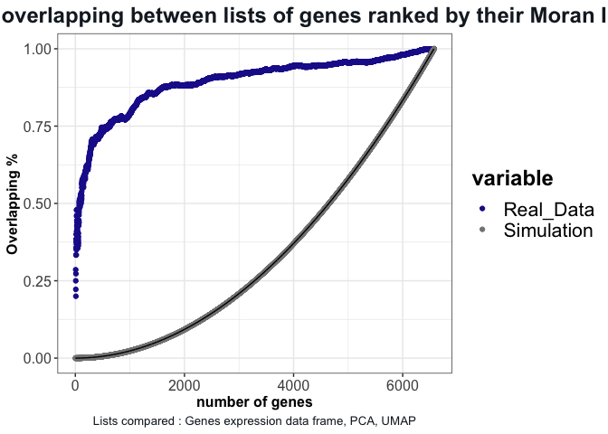

Tuning `n_neighbors`
--------------------

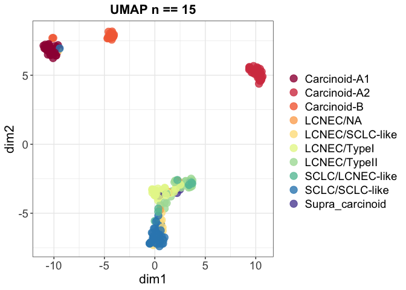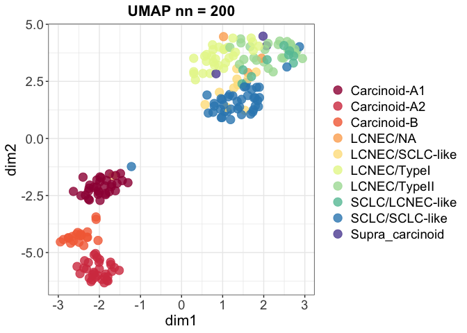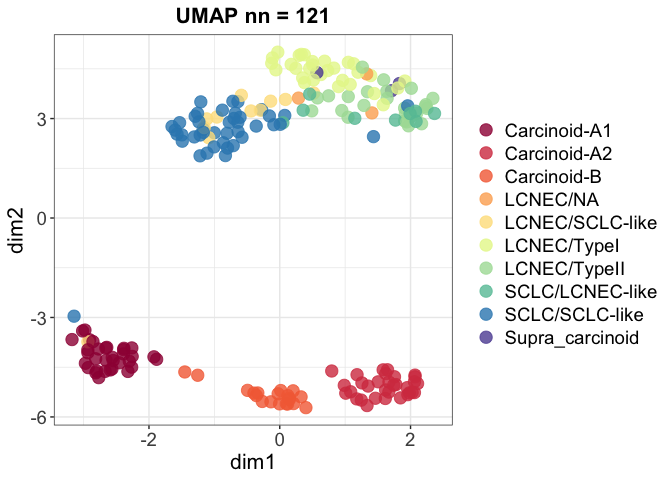

### Centrality preservation

``` r
acp_fig1_li_df$Sample_ID <- as.character(acp_fig1_li_df$Sample_ID)
acp_4D_li_df$Sample_ID <- as.character(acp_4D_li_df$Sample_ID)
umap1_res_df$Sample_ID <- as.character(umap1_res_df$Sample_ID)
umap121_res_df$Sample_ID <- as.character(umap121_res_df$Sample_ID)
umap208_res_df$Sample_ID <- as.character(umap208_res_df$Sample_ID)
List_projection <- list(data.frame(acp_fig1_li_df), data.frame(acp_4D_li_df), data.frame(umap1_res_df[,2:3]), data.frame(umap121_res_df[,2:3]), data.frame(umap208_res_df[,2:3]))

colnames(gene_expr_type_LNEN_df)[1] <- "Sample_ID"
gene_expr_df_filter <- merge(gene_expr_type_LNEN_df, acp_fig1_li_df[,1], by = "Sample_ID")

Main_CP_res_NN <- CP_main(l_data = List_projection , list_K = seq(from= 1, to = 210, by = 5) , dataRef = gene_expr_df_filter , colnames_res_df = c("pca_2D", "pca_4D","umap_md=0.1_nn=15", "umap_md=0.1_nn=122", "umap_md=0.1_nn=208") , filename = NULL , graphics = TRUE, stats = TRUE)

saveRDS(Main_CP_res_NN, "Main_CP_res_NN.rds")
```

``` r
Main_CP_res_NN$Paired_wilocoxon_test
```

    ##                          pca_2D       pca_4D umap_md=0.1_nn=15
    ## pca_4D             4.547474e-12           NA                NA
    ## umap_md=0.1_nn=15  1.179245e-04 4.547474e-12                NA
    ## umap_md=0.1_nn=122 1.000000e+00 1.032458e-01       0.010574922
    ## umap_md=0.1_nn=200 3.387873e-01 1.000000e+00       0.001549583
    ##                    umap_md=0.1_nn=122
    ## pca_4D                             NA
    ## umap_md=0.1_nn=15                  NA
    ## umap_md=0.1_nn=122                 NA
    ## umap_md=0.1_nn=200       5.579505e-05

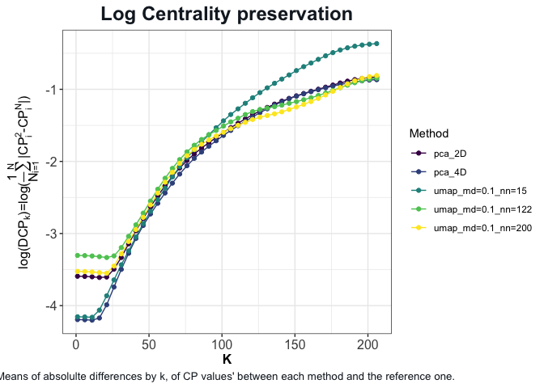

### Sequence difference view

``` r
acp_fig1_li_df <- acp_fig1_li_df[-which(acp_fig1_li_df$Sample_ID == "S00716_A"| acp_fig1_li_df$Sample_ID == "S02322.R2"),]

acp_4D_li_df <- acp_4D_li_df[-which(acp_4D_li_df$Sample_ID == "S00716_A" | acp_4D_li_df$Sample_ID == "S02322.R2"),]
                 
gene_expr_df_filter <- gene_expr_df_filter[-which(gene_expr_df_filter$Sample_ID == "S00716_A"| gene_expr_df_filter$Sample_ID == "S02322.R2"),]
            
List_projection <- list(data.frame(acp_fig1_li_df), data.frame(acp_4D_li_df),data.frame(umap1_res_df[,1:3]), data.frame(umap121_res_df[,1:3]), data.frame(umap208_res_df[,1:3]))

Main_SQ_res_NN <- Seq_main(l_data = List_projection , dataRef = gene_expr_df_filter, listK = seq(from= 1, to = 208, by = 5), colnames_res_df = c("pca_2D", "pca_4D","umap_md=0.1_nn=15", "umap_md=0.1_nn=121", "umap_md=0.1_nn=208")  , filename = NULL , graphics = TRUE, stats = TRUE) #
saveRDS(Main_SQ_res_NN, "Main_SQ_res_NN.rds")
```

    ##                          pca_2D2      pca_4D3 umap_md=0.1_nn=154
    ## pca_4D3             1.130670e-07           NA                 NA
    ## umap_md=0.1_nn=154  1.496022e-04 2.070022e-05                 NA
    ## umap_md=0.1_nn=1215 4.005369e-01 1.242616e-05       2.858142e-05
    ## umap_md=0.1_nn=2086 3.945763e-01 9.099003e-06       3.134623e-05
    ##                     umap_md=0.1_nn=1215
    ## pca_4D3                              NA
    ## umap_md=0.1_nn=154                   NA
    ## umap_md=0.1_nn=1215                  NA
    ## umap_md=0.1_nn=2086           0.4408388

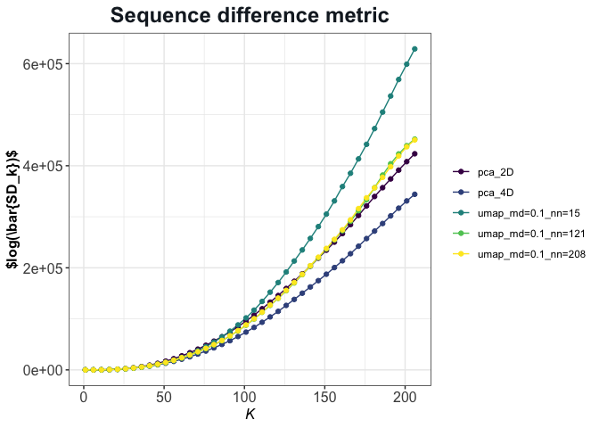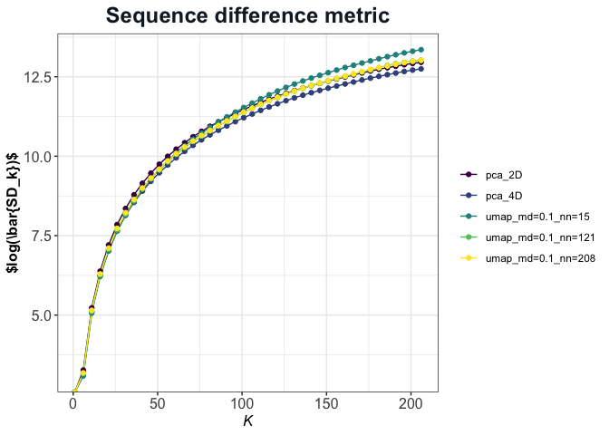
